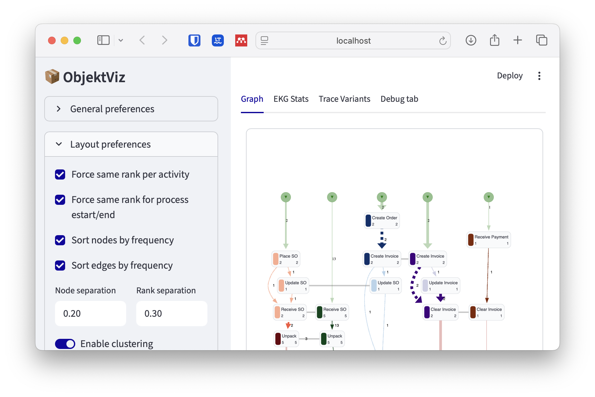
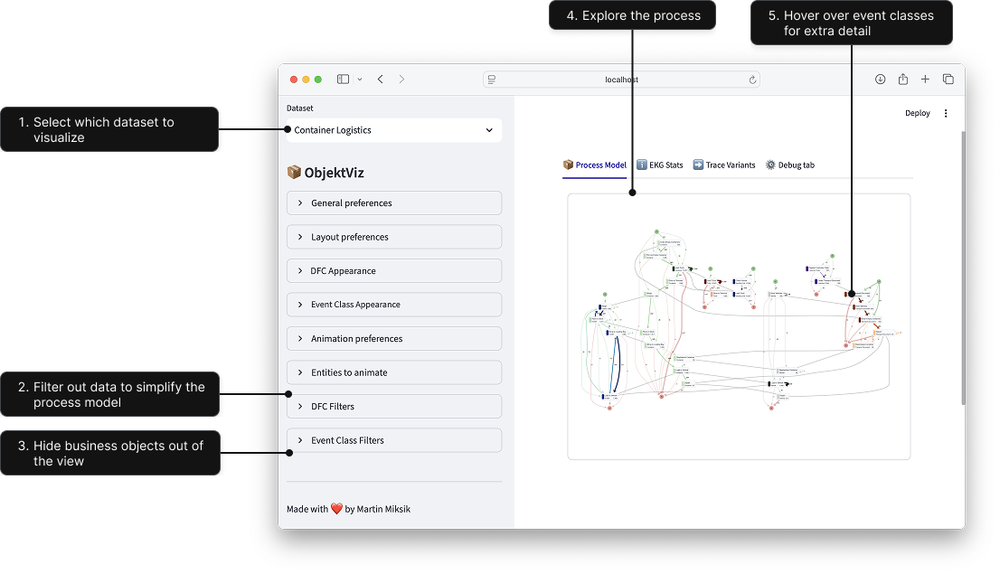

# 📦 ObjektViz

<p align="center">
    
</p>

> ObjektViz is a visualizer for object-centric process models that enables users to explore and analyze even _very complex_ processes involving multiple interacting objects.

## Features
- 🔍 **Interactive Visualization**: Explore object-centric process models with intuitive visualizations.
- 🤝 **Multi-Object Support**: Analyze processes involving multiple interacting objects seamlessly.
- ⚙️ **Customizable**: Every dataset, every process is different. ObjektViz allows you to customize visualizations to fit your data.
- 🧩 **Manage Complexity**: Designed to handle very complex processes without overwhelming the user.
- ▶️ **Token Replay**: Replay the flow of tokens through the process to understand dynamics and interactions, even for **multi-object** scenarios.
- 🔄 **Morphing Visualizations**: Smoothly transition between different views and representations of the process model to understand various aspects of the data.

## Quick Start
ObjektViz has a lot of customization, and is built with the idea that you as a user will compose your own dashboard for the analysis you have at hand. However, to get you started quickly, we provide some example dashboards that you can run and explore.

In the examples we use KuzuDB, which works fine for small examples and the setup is easy. For real-world datasets, you might use Neo4J, but that requires more setup.
We have exported and processed some OCEL datasets into EKG and generated aggregated views (i.e. process models) for you to explore in the examples.

1. Clone the repository:
   ```bash
   git clone git@github.com:mamiksik/ObjektViz.git
2. Navigate to the project directory:
   ```bash
   cd ObjektViz
3. Install the required dependencies (we use [uv](https://docs.astral.sh/uv/) to manage the Python environment and dependencies):
   ```bash
   uv sync

5. Run the example dashboard:
    ```bash
   uv run python -m streamlit run examples/generic_ocel_viewer.py
   ```
> IMPORTANT: Do **not** use streamlit run from the command line directly, as this will lead to issues with imports.

> INFO: Using Chrome is strongly recommended. Mozilla Firefox and Safari should also work. (Although Safari does not support token replay.)

> INFO: Token Replay for now requires APOC library and is thus not available with KuzuDB

<p align="center">
    
</p>

## Feature spotlight 

**Morphing and Animation** - ObjektViz supports smooth morphing between different process model views. This allows users to transition seamlessly from one perspective to another, this helps to manage complexity and understand different aspects of the process.
<p align="center">
    
</p>

**Shaders** - color lightness and thickness of edges play critical role in making a proces s model understandable. ObjektViz supports a variety of shaders that can be applied to nodes and edges to highlight different aspects of the process model or to deal with skewed distributions.
<p align="center">
    
</p>

**Token Replay** - understand the dynamics of your process by replaying tokens through the process model. This feature allows you to visualize how different objects interact over time within the process.
<p align="center">
    
</p>

## Import your own OCEL dataset
To import your own OCEL dataset, you need to convert it into EKG format first and then generate aggregated views (i.e., process models) from it.
We provide scripts to help you with this process in the `examples` folder.

1. Convert OCEL to EKG and infer aggregated views:
   ```bash
   uv run python examples/ocel/kuzudb/process_ocel_to_kuzudb.py path/to/your/ocel.json path/to/save/ekg.kuzu
   ```
2. Copy the example dashboard script and modify it to point to your newly created EKG database. The line to change is where the database is initialized:
    ```python
    db = kuzu.Database("path/to/save/ekg.kuzu")
    ```
3. Run your modified dashboard:
    ```bash
    uv run python -m streamlit run path/to/your/custom_dashboard.py
    ```

# ObjektViz Proclet Metamodel (Work In Progress - Subject to Change)
<p align="center">
    
</p>

