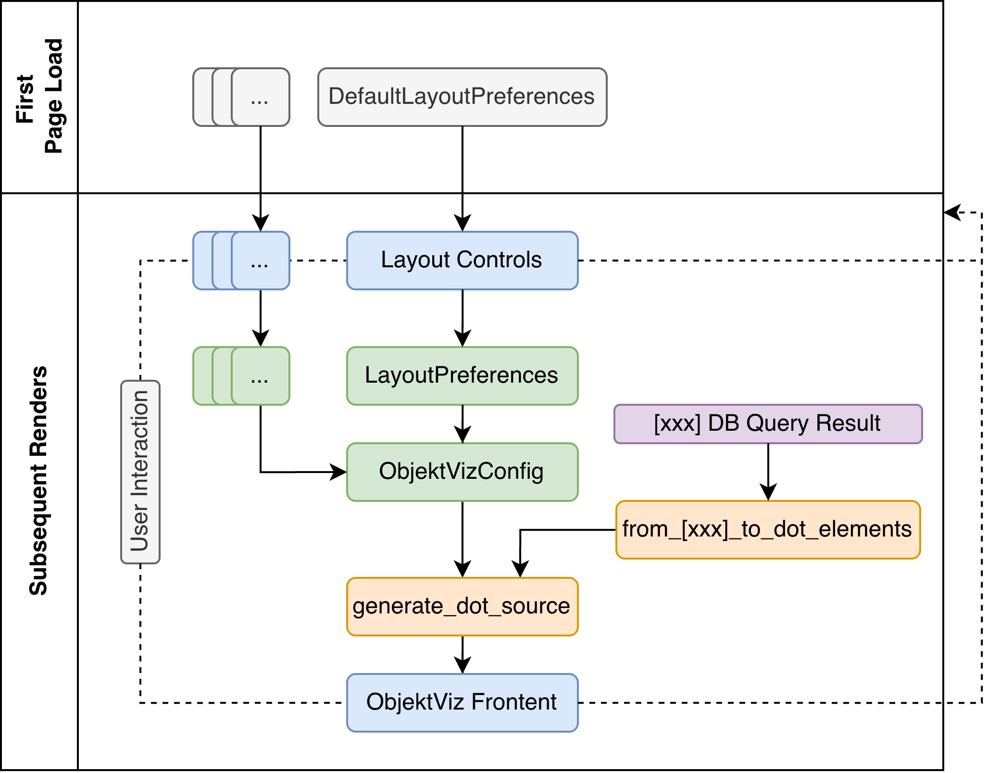

# Backend Concepts

The ObjektViz backend has one job: transform your Event Knowledge Graph data into dot source. 


You can think of the data flow in the following diagram:

[//]: # (```)
[//]: # (  Repository &#40;Database Connection&#41; ──────┐)
[//]: # (  Preferences ─────┐                     │)
[//]: # (                   ├─► BackendConfig ────├─► from_[db]_to_dot_elements ─► generate_dot_source ─► DOT Source)
[//]: # (  Filters ─────────┘                     │)
[//]: # (  shaders_factory ───────────────────────┘)
[//]: # (```)

<figure markdown="span">
  { width="500" }
</figure>

* **Repository (Purple)**: Gets data from your database (Neo4j, KuzuDB, etc.)
* **BackendConfig (Green)**: Combines all your preferences (layout, filters, shaders) into one configuration
* **from_[db]_to_dot_elements (Orange)**: Dot elements representing nodes and edges in the graph and can be converted to DOT string.
* **generate_dot_source (Orange)**: Takes dot elements, backend configuration and generates a DOT source string.
* **DOT Source**: GraphViz-compatible graph description that the frontend renders that is paased to ObjektViz Frontend component (Blue).


## Repository

Repositories hide database differences behind a common interface. This is usefull since there are different flavours of cypher or in case you want to use completly diffrernt LPG database. 

```python
# Both work the same way
neo4j_repo = Neo4JEKGRepository(neo4j_driver)
kuzu_repo = KuzuEKGRepository(kuzu_connection)

# Same interface
nodes, edges, syncs = repo.proclet(class_type="EventType")
attributes = repo.class_attributes(class_type="EventType")
```
!!! note "Adding a new database?"
    Implement `AbstractEKGRepository`, if the query result is not compatble with Neo4J or KuzuDB, you should also extend `DotNode` and `DotEdge` for the new database to allow the query to be converted to DOT string.

---

## BackendConfig
BackendConfig you can control the appearance and content of your visuzlied graph the BackendConfig class that is then passed to the `generate_dot_source` function. If you are looking into customizing the bahavor look at the source `BackendConfig` and the related preferences classes, they are all well typed and include doc strings explain what each attribute does.

## Preferences

Preferences are structured data classes that define how your visualization should look and behave. They come from the control components and get bundled into the BackendConfig:

- **LayoutPreferences**: How to arrange nodes (clustering, spacing, direction)
- **EventClassPreferences**: What to show in nodes (title, captions, shading attribute)  
- **DFCPreferences**: How to style edges (thickness range, labels, shading attribute)

These get created by the control components and passed to BackendConfig. Most users don't create these directly.

## Filters
Filters decide which nodes and edges appear in your visualization:

```python
# Show everything
filter = DummyFilter()

# Show only high-frequency events
filter = RangeFilter("frequency", min_value=10)

# Show orders OR payments
filter = OrFilter([
    MatchFilter("EntityType", ["Order"]),
    MatchFilter("EntityType", ["Payment"])
])

# Combine conditions
filter = AndFilter([
    MatchFilter("EntityType", ["Equipment"]),
    RangeFilter("frequency", (5, 50))
])
```

Use this in your dashboard:
```python
config = BackendConfig(
    event_class_root_filter=my_node_filter,
    dfc_root_filter=my_edge_filter,
    # ... other settings
)
```

## Shaders
Shaders map your data values to node/edge color and edge thickness:

```python
# Basic: min/max values become lightest/darkest
shader_factory = lambda config, attr, cmap: NormalizedShader(config, attr, cmap)

# Better: ignore outliers using percentiles
shader_factory = lambda config, attr, cmap: PercentileShader(
    config, attr, cmap, percentile_range=(10, 90)
)

# Best for skewed data: robust statistical scaling
shader_factory = lambda config, attr, cmap: RobustScalerShader(config, attr, cmap)
```

The general preferences panel has a selector for the provided shader types, but you can also define your own shader factory function with your own shader implementation.

!!! now "When to use which shader"

    - Use **NormalizedShader** when your data is well-behaved
    - Use **PercentileShader** when you have outliers
    - Use **RobustScalerShader** when your data is heavily skewed


## Putting It Together

Here's the typical flow in your dashboard:

```python
# 1. Get user preferences from UI controls
layout_prefs = layout_preferences_input(defaults, attributes)
...

# 2. Create filters based on user input
node_filter = DummyFilter()
if st.checkbox("Filter low-frequency events"):
    node_filter = RangeFilter("frequency", min_value=st.slider("Min frequency", 1, 100))

# 3. Create shader factory

my_shader_factory = builtin_shader_selector() # OR 
my_shader_factory = lambda config, attr, cmap: MyCustomShader(config, attr, cmap)

# 3. Configure backend
config = BackendConfig(
    layout_preferences=layout_prefs,
    event_class_root_filter=node_filter,
    shader_factory=my_shader_factory,
    ...
)

# 4. Prepare databse query result
event_classes_db, dfc_db, sync_db = queries.proclet(class_type)
dot_nodes, dot_edges, node_shaders, edge_shaders, _ = from_[kuzu]_to_dot_elements(
    event_classes_db, dfc_db + sync_db, config
)

# 4. Generate visualization
dot_source = generate_dot_source(dot_nodes, dot_edges, node_shaders, edge_shaders, config)

# 5. Show it
objektviz_component(dot_source, config)
```

!!! note 

    `from_[db]_to_dot_elements` the function is quite simple, it just wraps the result of the database query in Dot element subclasses.
    ```python 
    def from_kuzu_to_dot_elements(...):
      ...
      nodes = list(map(lambda node: [DB]DotNode(node, node_shaders, config), nodes))
      ...
    ```
---

## Common Customizations

**Different default colors?** Change `shader_groups_color` in your BackendConfig.

**Custom filtering logic?** Extend `AbstractFilter`:
```python
class MyCustomFilter(AbstractFilter):
    def is_passing(self, entity: dict) -> bool:
        # Your logic here
        return some_condition(entity)
```

**New database?** 

Extend `AbstractEKGRepository`:
```python
class MyDatabaseRepo(AbstractEKGRepository):
    def proclet(self, class_type: str):
        # Your database queries here
        return nodes, edges, syncs
```

Then create factory functions to convert your database results to DOT elements:

```python
def from_mydatabase_to_dot_elements(nodes_db, edges_db, config):
    dot_nodes = [MyDatabaseDotNode(node, config) for node in nodes_db]
    dot_edges = [MyDatabaseDotEdge(edge, config) for edge in edges_db]
    
    # Create shaders
    node_shaders = create_shaders(dot_nodes, config)
    edge_shaders = create_shaders(dot_edges, config)
    
    return dot_nodes, dot_edges, node_shaders, edge_shaders
```

The DOT node/edge classes handle converting your database records into GraphViz elements that respect filters and styling.

**Custom visual effects?** Extend `AbstractShader`:
```python
class MyCustomShader(AbstractShader):
    def shading_color(self, entity: dict) -> str:
        # Your color logic here
        return "#ff0000"
```

The backend is designed to be extended at these specific points. Most users will only need to customize filters and shaders.
