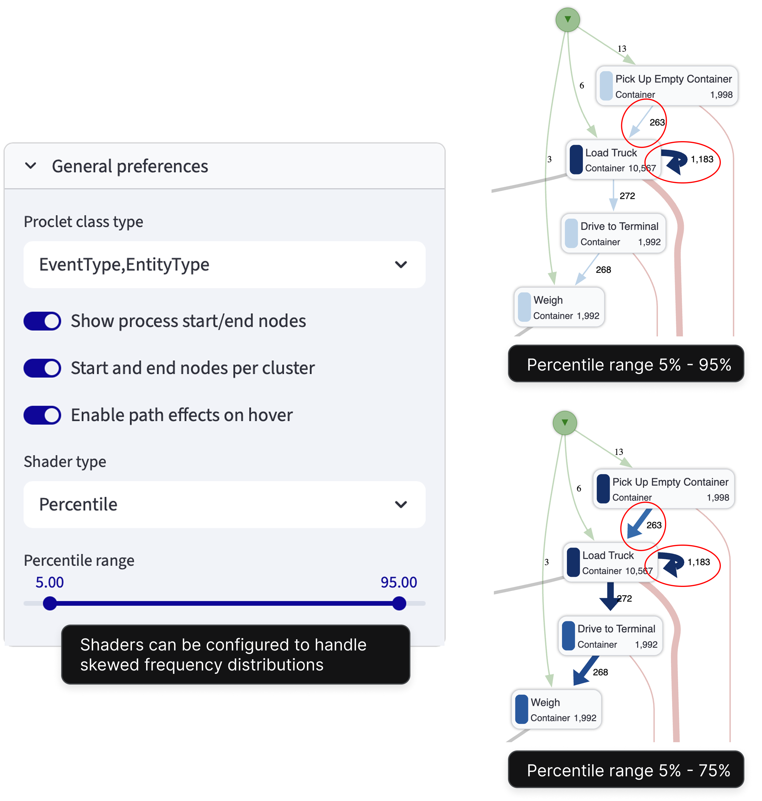
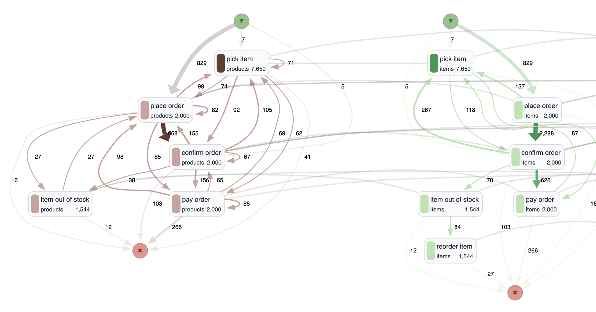
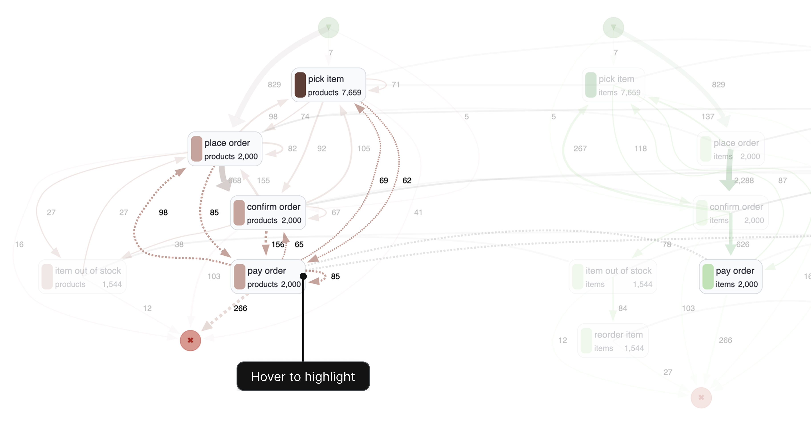

# Feature spotlight
[//]: # (# Feature spotlight)

!!! info "Power is in customization"
    
    ObjektViz offers a wide range of configuration options to customize the appearance and behavior of your process models. From node and edge styling to layout preferences, you can tailor the visualization to best suit your analysis needs. On this page, we highlight some of the key features that make ObjektViz a powerful tool for exploring complex object-centric processes.

## Shaders
Color lightness and thickness of edges play critical role in making a proces s model understandable. ObjektViz supports a variety of shaders that can be applied to nodes and edges to highlight different aspects of the process model or to deal with skewed distributions.
<figure markdown="span">
      { width="400" }
</figure>

## Filters
Filters allow you to focus on specific parts of your process model by including or excluding nodes and edges based on their attributes. This is especially useful for large and complex models, where you may want to analyze only a subset of the data or focus on particular interactions.

Filters are defined in python and can be as simple or complex as needed. For example, you can create filters to show only nodes of a certain type, edges that represent specific interactions, or even more complex conditions based on multiple attributes. In theory, you can create arbitrary complex boolean expressions to filter your data. 

!!! example "Example filtering logic"

    ```python
    # Show all start and end nodes, but filter out all other nodes that have low frequency
    node_root_filter = OrFilter([
        RangeFilter("StartCount", (1, 10000)),
        RangeFilter("EndCount", (1, 10000)),
        RangeFilter("Frequency", (1000, 10000)), 
    ])
    ```
The filters can be bind to streamlit input components to create interactive dashboards where users can adjust the filters on the fly and see how the visualization changes in response.

!!! example "Binding filters to Streamlit components"

    ```python
    # Bind Filter to Streamlit input components for interactive filtering
    node_root_filter = RangeFilter(
        "Frequency", 
        st.slider("Frequency Range", min_value=0, max_value=10000, value=(100, 1000))
    )
    ```

## Highlighting
Even well layout and styled object-centric process models can be overwhelming due to their complexity. ObjektViz includes few tricks to manage complexity, one of them is highlighting. When you hover over a node or edge, the related nodes and edges are highlighted to help you understand the local structure and interactions around that element. This makes it easier to explore the process model and understand how different objects are connected and interact with each other.

!!! example "Before"

    <figure markdown="span">
          { width="550" }
    </figure>

!!! example "After"
    <figure markdown="span">
          { width="550" }
    </figure>

## Token Replay 
Understand the dynamics of your process by replaying tokens through the process model. This feature allows you to visualize how different objects interact over time within the process.
<figure markdown="span">
      { width="600" }
</figure>

## Morphing and Animation
ObjektViz supports smooth morphing between different process model views. This allows users to transition seamlessly from one perspective to another, this helps to manage complexity and understand different aspects of the process.
<figure markdown="span">
      { width="600" }
</figure>