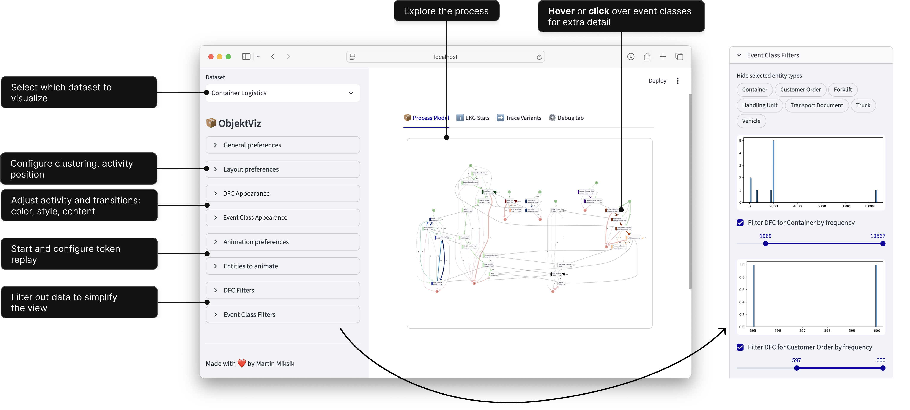
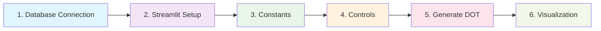
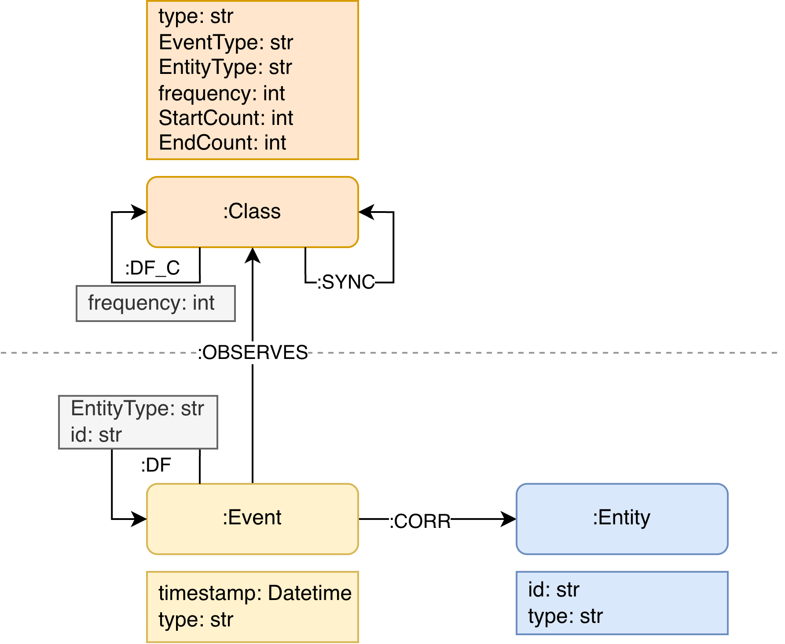

# Getting Started with 📦 ObjektViz

<figure markdown="span">
  { width="700" }
</figure>

ObjektViz is a visualizer for object-centric process models that enables users to explore and analyze even very complex processes involving multiple interacting objects. Traditional process mining tools struggle with complex, multi-object processes. ObjektViz is designed specifically for exploring these object-centric processes through customizable, interactive dashboards.


!!! tip "Features"

    - 🔍 **Interactive Visualization**: Explore object-centric process models with intuitive visualizations.
    - 🤝 **Multi-Object Support**: Analyze processes involving multiple interacting objects seamlessly.
    - ⚙️ **Customizable**: Every dataset, every process is different. ObjektViz allows you to customize visualizations to fit your data.
    - 🧩 **Manage Complexity**: Designed to handle very complex processes without overwhelming the user.
    - ▶️ **Token Replay**: Replay the flow of tokens through the process to understand dynamics and interactions, even for **multi-object** scenarios.
    - 🔄 **Morphing Visualizations**: Smoothly transition between different views and representations of the process model to understand various aspects of the data.


!!! note "Useful Concepts to Know"
    
    - **Streamlit**: For building Python web apps - see [Streamlit docs](https://docs.streamlit.io/library/get-started)
    - **Graph databases**: Basic concepts - see [Neo4j introduction](https://neo4j.com/developer/graph-database/)  
    - **Process mining**: Event logs and process models - see [Process Mining intro](https://www.processmining.org/)

## What is ObjektViz composed of?
ObjektViz provides three key components:

1.  **Backend**: Transforms EKG data into `DOT` graph descriptor
2.  **Frontend**: Renders the `DOT` graph descriptor into interactive process models in the browser
3.  **Streamlit-based UI layer**: Interactive controls and components

## Building Dashboards with ObjektViz
We will build interactive dashboards to view OCEL dataset that allows you to:

- **Explore** complex multi-object processes visually
- **Filter** and **shade** nodes/edges by any attribute  
- **Animate** token replay through the process

```
Your OCEL Data → EKG Database → ObjektViz Dashboard → Interactive Visualization
```

### Setting up ObjektViz
1. Clone the repository:
   ```bash
   git clone git@github.com:mamiksik/ObjektViz.git
   ```
2. Navigate to the project directory:
   ```bash
   cd ObjektViz
   ```
3. Install the required dependencies (we use [uv](https://docs.astral.sh/uv/) to manage the Python environment and dependencies):
   ```bash
   uv sync
   ```

!!! tip "Quick Start"

    run `uv run python -m streamlit run examples/generic_ocel_viewer.py` to see ObjektViz in action on the included OCEL datasets.


### Convert OCEL Data to EKG Format
To import your own OCEL dataset, you need to convert it into EKG format first and then generate aggregated views (i.e., process models) from it.
We provide scripts to help you with this process in the `examples` folder.
```bash
uv run python examples/ocel/kuzudb/process_ocel_to_kuzudb.py path/to/your/ocel.json path/to/save/ekg.kuzu
```

!!! tip "Building EKG from scratch"

    If you want to  build your own EKG from scratch, check out the section on "Data Requirements" below. It explains the core EKG elements and the expected database structure in more detail.


### Copy and Modify Template Dashboard
Copy one of the example dashboards (e.g. 'examples/generic_ocel_viewer.py') script and modify it to point to your newly created EKG database. The line to change is where the database is initialized:
```python
db = kuzu.Database("path/to/save/ekg.kuzu")
```

Run your modified dashboard:
```bash
uv run python -m streamlit run path/to/your/custom_dashboard.py
```

!!! example

    Now you should be able to see your own OCEL dataset visualized in the dashboard! From here, you can start customizing the dashboard to fit your specific needs and explore your data in depth.


### Dashboard Template Structure

!!! tip

    You are free to structure your dashboard as you like, the above is just a common pattern we use in our examples. The key is to have a Streamlit page where you can place your control components and visualization components.

#### 1. Set up database connection

Start the dashboard by establishing a connection to your EKG database
```python
queries = ov_kuzu.KuzuEKGRepository(...)
...
```

!!! note "Neo4j Support"

    We also provide **drop-in** adapter for Neo4j, simply rplace the KuzuDB connection with a Neo4j driver and repository.


#### 2. Setup Streamlit page layout and tabs 
```python
objektviz_sidebar = ov_components.setup_objektviz_page()
process_model_tab, ekg_stats_tab, trace_variants_tab, debug_tab = st.tabs(
    ["📦 Process Model", "ℹ️ EKG Stats", "➡️ Trace Variants", "⚙️ Debug tab"]
)
...
```
!!! info Important

    Never forget to call `ov_components.setup_objektviz_page()`, since it also registers necessary session state variables

#### 3. Setup constants and default values for the dashboard
```python
PROCLET_TYPES = ["EventType,EntityType"]
DEFAULT_LAYOUT_PREFERENCES = DefaultLayoutPreferences(...)
DEFAULT_CONNECTION_PREFERENCES = DefaultConnectionPreferences(...)
```

!!! note "Default Values on Page Load"
   
    If you want to show a specific view on page load, you can pass values to the `Default[XXX]Preferences` constructor 

#### 4. Setup control components to configure the visualization
```python
# General preferences that affect the entire visualization 
with objektviz_sidebar:
    class_type, ... = ov_components.general_preferences(PROCLET_TYPES)

# Now that we know the class type (i.e., which process model view the 
# user wants to see), we can query the database for the relevant 
# data to set up the rest of the control components
event_classes_db, dfc_db, sync_db = queries.proclet(class_type)

# Register the rest of the control components
with objektviz_sidebar:
    ... = ov_components.preferences_group(...)
    root_edge_filter = ov_components.frequency_filter_per_entity_type(...)
    ...
```

!!! note "Custom Filtering Logic"
    
    Writing custom filtering logic is probably one of the first changes you will want to make to the dashboard. Check out the streamlit controls documentation for more on how to do it. 
    
#### 5. Generate DOT source based on the user preferences and database query results
```python
# Gather the preferences, filters and shaders into a single config 
# object to pass to the DOT generation function
objektviz_config = BackendConfig(
    dfc_preferences=dfc_preferences, 
    event_class_root_filter=root_node_filter,
    ...
)

# Convert database query results into DotNode and DotEdge instances, applying 
# filters and shaders in the process
wrapped_values = ov_kuzu.from_kuzu_to_dot_elements(
    event_classes_db, dfc_db + sync_db, objektviz_config
)

# Generate DOT source
dot_src, edge_node_map, node_edge_map, node_node_map = generate_dot_source(
    *wrapped_values
)
```
#### 6. Display the visualization
```python
# Create data payload that will be passed to ObjektViz fronend
graphviz_payload = GraphFrontendPayload(
    dot_source=dot_src,
    ...
)

# Render the visualization in the process model tab
with process_model_tab:
    ov_components.full_proclet_view(
        graph_payload=graphviz_payload,
        queries=queries,
        class_type=class_type,
        ...
    )

```


## Data Requirements

ObjektViz works with **Event Knowledge Graphs (EKGs)** - graph representations of event data with pre-computed aggregated views.

### Core EKG Elements

| Element | Description | Example                                  |
|---------|-------------|------------------------------------------|
| **:Class nodes** | Event classes (aggregated events) | "Order Placed", "Payment Processed"      |
| **:DF_C edges** | Directly-follows relationships | Order Placed → Payment Processed         |
| **:SYNC edges** | Cross-entity synchronizations | Place Order (Item) ↔ Place Order (Order) |

!!! info "EKG Metamodel"

    <figure markdown="span">
      { width="400" }
    </figure>

### Database Options

| Database | Best For             | Setup | Notes                     |
|----------|----------------------|-------|---------------------------|
| **KuzuDB** | Prototyping, learning | Easy (embedded) | Deprecated technology     |
| **Neo4j** | Production           | Medium (server) | The fold standard for LPG |

[//]: # (### Process Model Types)

[//]: # ()
[//]: # (ObjektViz expects each `:Class` node to have a `type` attribute, allowing multiple views of the same process:)

[//]: # (- **EventType**: Traditional activity-based process model)

[//]: # (- **ResourceType**: Resource interaction patterns)

[//]: # (- **Custom**: Any aggregation you define &#40;location, priority, etc.&#41;)

[//]: # ()
[//]: # (---)

[//]: # ()
[//]: # (## The ObjektViz Stack)

[//]: # ()
[//]: # (### 1. Data Layer - Event Knowledge Graphs)

[//]: # (Your event data stored as a graph with pre-computed aggregated views:)

[//]: # ()
[//]: # (- **:Class nodes** - Event classes &#40;e.g., "Order Placed", "Payment Processed"&#41;  )

[//]: # (- **:DF_C edges** - Directly-follows relationships between event classes)

[//]: # (- **:SYNC edges** - Synchronization between different entity types)

[//]: # ()
[//]: # (**Supported Databases**: Neo4j &#40;production&#41;, KuzuDB &#40;prototyping&#41;)

[//]: # ()
[//]: # (### 2. Backend - Data Transformation)

[//]: # (Transforms your graph data into visualizations through:)

[//]: # (- **Repository pattern** for database abstraction)

[//]: # (- **Filters** to control what appears)

[//]: # (- **Shaders** to map attributes to colors/thickness)

[//]: # (- **Layout preferences** for spatial arrangement)

[//]: # ()
[//]: # (### 3. Frontend - Interactive Components  )

[//]: # (Streamlit-based UI components that let users:)

[//]: # (- Choose visualization preferences &#40;control components&#41;)

[//]: # (- View the resulting process model &#40;ObjektViz component&#41;)

[//]: # (- Replay tokens through the process &#40;animation&#41;)

[//]: # ()
[//]: # (---)

[//]: # ()
[//]: # (## Your First Dashboard)

[//]: # ()
[//]: # (### 1. Use the Example)

[//]: # (Start with the generic dashboard template:)

[//]: # ()
[//]: # (```python)

[//]: # (# Clone and setup)

[//]: # (git clone git@github.com:mamiksik/ObjektViz.git)

[//]: # (cd ObjektViz)

[//]: # (uv sync)

[//]: # ()
[//]: # (# Run example dashboard)

[//]: # (uv run python -m streamlit run examples/generic_ocel_viewer.py)

[//]: # (```)

[//]: # ()
[//]: # (### 2. Import Your Data)

[//]: # (Convert your OCEL data to EKG format:)

[//]: # ()
[//]: # (```python)

[//]: # (# Process your OCEL file)

[//]: # (uv run python examples/ocel/kuzudb/process_ocel_to_kuzudb.py your_data.jsonocel output.kuzu)

[//]: # ()
[//]: # (# Update database path in dashboard)

[//]: # (db = kuzu.Database&#40;"output.kuzu"&#41;  # Change this line)

[//]: # (```)

[//]: # ()
[//]: # (### 3. Customize Defaults)

[//]: # (Most customization starts with changing default values:)

[//]: # ()
[//]: # (```python)

[//]: # (# Modify these to change initial dashboard state)

[//]: # (DEFAULT_LAYOUT_PREFERENCES = DefaultLayoutPreferences&#40;)

[//]: # (    rank_direction="LR",  # Left-to-right layout)

[//]: # (    clustering_keys=["EntityType"]  # Group by entity type)

[//]: # (&#41;)

[//]: # ()
[//]: # (DEFAULT_CONNECTION_PREFERENCES = DefaultConnectionPreferences&#40;)

[//]: # (    shading="duration",  # Color edges by duration instead of frequency)

[//]: # (    pen_range=&#40;1, 8&#41;     # Thinner edge range)

[//]: # (&#41;)

[//]: # (```)

[//]: # ()
[//]: # (!!! note "Streamlit Refreshing")

[//]: # (    Default values only apply on initial load. After changing defaults, do a hard refresh &#40;Ctrl+F5&#41; to see changes.)

[//]: # ()
[//]: # (---)

[//]: # ()
[//]: # (## Common Customizations)

[//]: # ()
[//]: # (### Add Custom Filtering)

[//]: # (Create interactive filters tied to UI controls:)

[//]: # ()
[//]: # (```python)

[//]: # (# Start with no filtering)

[//]: # (node_filter = DummyFilter&#40;&#41;)

[//]: # ()
[//]: # (# Add conditional filtering)

[//]: # (if st.checkbox&#40;"Filter high-frequency events only"&#41;:)

[//]: # (    min_freq = st.slider&#40;"Minimum frequency", 1, 100, 10&#41;)

[//]: # (    node_filter = RangeFilter&#40;"frequency", min_value=min_freq&#41;)

[//]: # ()
[//]: # (# Combine multiple conditions)

[//]: # (if st.checkbox&#40;"Advanced filtering"&#41;:)

[//]: # (    node_filter = AndFilter&#40;[)

[//]: # (        MatchFilter&#40;"EntityType", st.multiselect&#40;"Entity types", ["Order", "Customer"]&#41;&#41;,)

[//]: # (        RangeFilter&#40;"frequency", st.slider&#40;"Frequency range", 0, 100, &#40;10, 90&#41;&#41;&#41;)

[//]: # (    ]&#41;)

[//]: # (```)

[//]: # ()
[//]: # (!!! note "Streamlit Behavior")

[//]: # (    Default values only apply on initial page load. After changing code, do a hard refresh &#40;Ctrl+F5&#41; to see changes take effect.)

[//]: # ()
[//]: # (---)

[//]: # ()
[//]: # (## Dashboard Architecture)

[//]: # ()
[//]: # (```)

[//]: # (┌─────────────────────────────────────────────────────────────────────────┐)

[//]: # (│                          ObjektViz Dashboard                           │)

[//]: # (└─────────────────────────────────────────────────────────────────────────┘)

[//]: # ()
[//]: # (UI Controls ──┐)

[//]: # (              │)

[//]: # (Default Prefs ├─► Control Components ─► Preferences ──┐)

[//]: # (              │                                       │)

[//]: # (Database ─────┴─► Repository ─────────────────────────┼─► Backend Config)

[//]: # (                                                      │)

[//]: # (                                                      ▼)

[//]: # (                                              generate_dot_source)

[//]: # (                                                      │)

[//]: # (                                                      ▼)

[//]: # (                                            ObjektViz Component)

[//]: # (                                                      │)

[//]: # (                                                      ▼)

[//]: # (                                              Interactive Viz)

[//]: # (```)

[//]: # ()
[//]: # (**The flow**:)

[//]: # (1. **UI Controls** gather user preferences through Streamlit components)

[//]: # (2. **Control Components** convert UI state into structured preferences  )

[//]: # (3. **Backend Config** combines preferences with data from repository)

[//]: # (4. **DOT Generation** applies filters, shaders, and layout to create visualization)

[//]: # (5. **Frontend** renders the interactive process model)

[//]: # ()
[//]: # (---)

[//]: # ()
[//]: # (## Key Concepts)

[//]: # ()
[//]: # (### Process Model Types)

[//]: # (Switch between different aggregated views of your data:)

[//]: # (- **EventType**: Traditional activity-based process model)

[//]: # (- **ResourceType**: Resource interaction patterns  )

[//]: # (- **Custom**: Any attribute you've aggregated by)

[//]: # ()
[//]: # (### Entity Types vs Process Types)

[//]: # (- **Entity Types**: Objects in your process &#40;Customer, Order, Product&#41;)

[//]: # (- **Process Types**: How you've aggregated events &#40;by activity, by resource, etc.&#41;)

[//]: # ()
[//]: # (### Clustering)

[//]: # (Group related nodes visually using attribute values:)

[//]: # ()
[//]: # (```python)

[//]: # (# Single-level clustering)

[//]: # (clustering_keys = ["EntityType"]  # Orders, Customers, Products in separate groups)

[//]: # ()
[//]: # (# Multi-level clustering  )

[//]: # (clustering_keys = ["EntityType", "Location"]  # Nested: Orders-NYC, Orders-London, etc.)

[//]: # (```)

[//]: # ()
[//]: # (---)

[//]: # ()
[//]: # (## Advanced Customization)

[//]: # ()
[//]: # (### Custom Visual Effects)

[//]: # (Define how attributes map to visual properties:)

[//]: # ()
[//]: # (```python)

[//]: # (# Custom shader for your data distribution)

[//]: # (def my_shader_factory&#40;config, attribute, colormap&#41;:)

[//]: # (    if "duration" in attribute:)

[//]: # (        # Use percentile shader for duration &#40;often has outliers&#41;)

[//]: # (        return PercentileShader&#40;config, attribute, colormap, percentile_range=&#40;5, 95&#41;&#41;)

[//]: # (    else:)

[//]: # (        # Use robust scaler for counts/frequencies)

[//]: # (        return RobustScalerShader&#40;config, attribute, colormap&#41;)

[//]: # (```)

[//]: # ()
[//]: # (### Add Custom Components)

[//]: # (Create domain-specific UI elements:)

[//]: # ()
[//]: # (```python)

[//]: # (def domain_specific_controls&#40;&#41;:)

[//]: # (    """Custom control panel for your specific use case.""")

[//]: # (    with st.expander&#40;"Domain Controls"&#41;:)

[//]: # (        priority_filter = st.selectbox&#40;"Priority Level", ["All", "High", "Medium", "Low"]&#41;)

[//]: # (        )
[//]: # (        if priority_filter != "All":)

[//]: # (            return MatchFilter&#40;"Priority", [priority_filter]&#41;)

[//]: # (    return DummyFilter&#40;&#41;)

[//]: # ()
[//]: # (# Use in your dashboard)

[//]: # (custom_filter = domain_specific_controls&#40;&#41;)

[//]: # (```)

[//]: # ()
[//]: # (### Multiple Databases)

[//]: # (Switch between databases without changing dashboard code:)

[//]: # ()
[//]: # (```python)

[//]: # (if use_neo4j:)

[//]: # (    repo = Neo4JEKGRepository&#40;neo4j_driver&#41;)

[//]: # (else:)

[//]: # (    repo = KuzuEKGRepository&#40;kuzu_connection&#41;)

[//]: # ()
[//]: # (# Same interface for both)

[//]: # (nodes, edges, syncs = repo.proclet&#40;class_type&#41;)

[//]: # (```)

[//]: # ()
[//]: # (### Performance Tips)

[//]: # (For large datasets:)

[//]: # (- Use **percentile shaders** to handle outliers)

[//]: # (- **Pre-filter** data in repository queries when possible  )

[//]: # (- **Limit clustering depth** to avoid layout complexity)

[//]: # (- **Cache expensive** computations with `@st.cache_data`)

[//]: # ()
[//]: # (### Extension Points)

[//]: # (- **New database**: Extend `AbstractEKGRepository`)

[//]: # (- **Custom filters**: Extend `AbstractFilter` )

[//]: # (- **Custom shaders**: Extend `AbstractShader`)

[//]: # (- **Custom components**: Follow Streamlit component patterns)

[//]: # ()
[//]: # (---)

[//]: # ()
[//]: # (## Next Steps)

[//]: # ()
[//]: # (1. **Try the examples** - Get familiar with the interface)

[//]: # (2. **Import your data** - Process your OCEL files to EKG format)

[//]: # (3. **Customize defaults** - Adjust initial settings for your data)

[//]: # (4. **Add filtering** - Create domain-specific filters)

[//]: # (5. **Advanced customization** - Extend components and backend logic)

[//]: # ()
[//]: # (!!! info "Need Help?")

[//]: # (    - Check the **Control Components** guide for UI customization)

[//]: # (    - See **Backend Concepts** for data flow and architecture details)

[//]: # (    - Look at example dashboards for real implementation patterns)